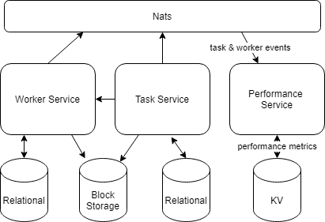

# Tugas

Tambahkan Performance Service pada aplikasi yang sudah dibuat sebelumnya

1. performance service
    menyediakan informasi mengenai histori transaksi yang dilakukan
    - simpan segala aktivitas transaksi di dalam KV
    - dapat diagregasi dengan menampilkan jumlah task dan worker yang dibuat, dihapus, diupdate (jika ada) 
    diakumulasikan (misalkan task.added rumusnya jumlah yg sebelumnya + 1)

2. object storage
    menggunakan minio untuk upload file
    - ganti file system ke object storage

Data yang diinginkan
- total pekerja
- total tugas
- total tugas yang selesai
- total tugas yang dibatalkan